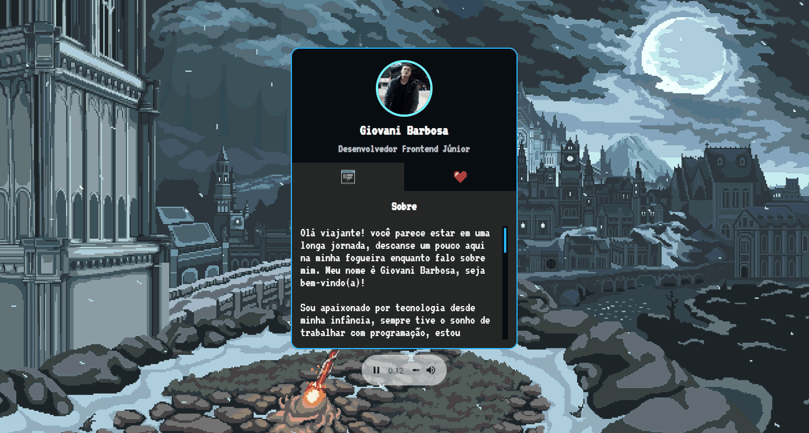

# Projeto mini portfolio
<a href="https://barbosagio.github.io/mini-portfolio/" target="_blank">Clique aqui para acessar meu site</a>

## Overview
### O projeto
Este projeto foi criado junto a comunidade Devemdobro na MapaDevWeek que rolou no mês de Outubro/2022. 
A intenção do projeto é criar uma página com um card de informações sobre mim e contato, servindo como um curriculo com a liberdade de personalizar da forma que desejar.

### Screenshot

## Meu processo
### Construção
- Criação do HTML e sua estrutura;
- Link dos arquivos CSS (style);
- Estilização dos elementos HTML;
- Design de imagens e cores para atualização do projeto;
- Construção do JavaScript para interação a partir do clique nas abas para mudança de informações.

## Programas utilizados
- HTML5
- CSS
- JavaScript 